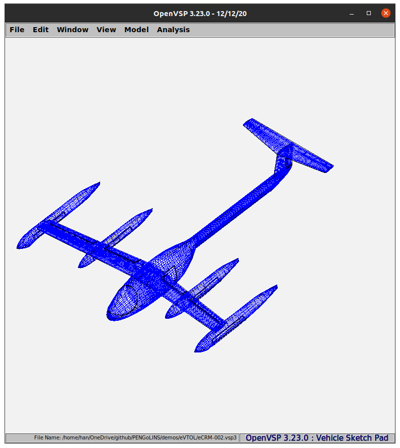
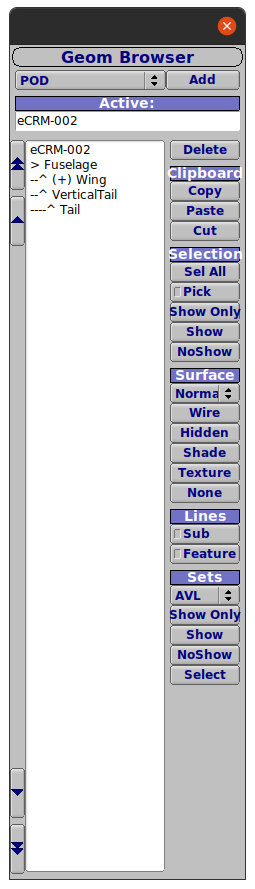
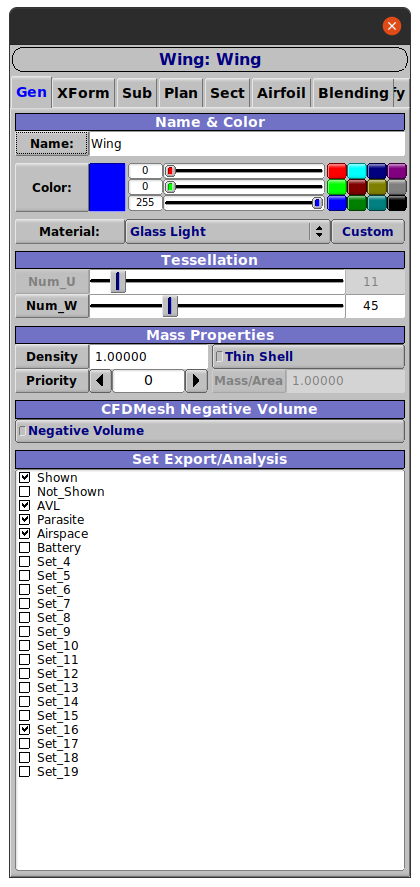
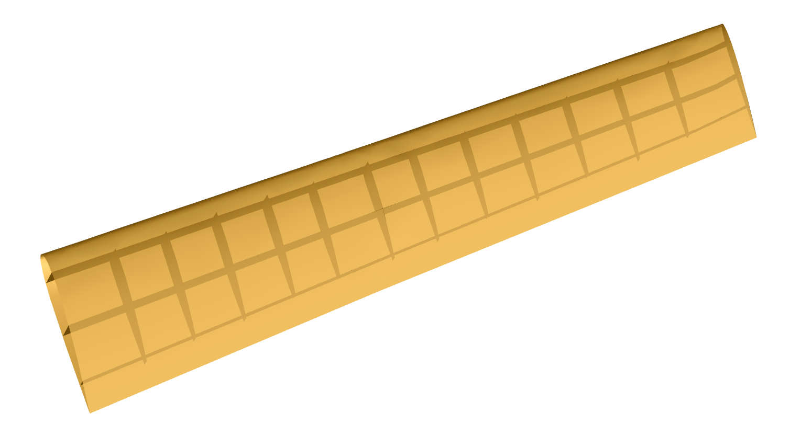
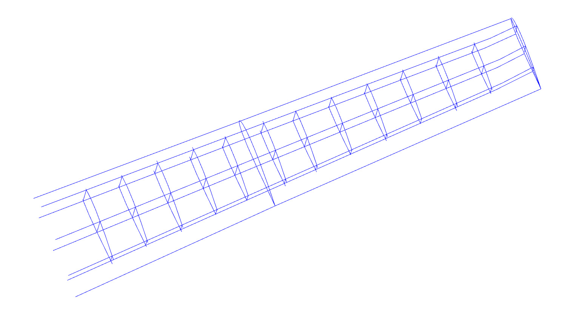
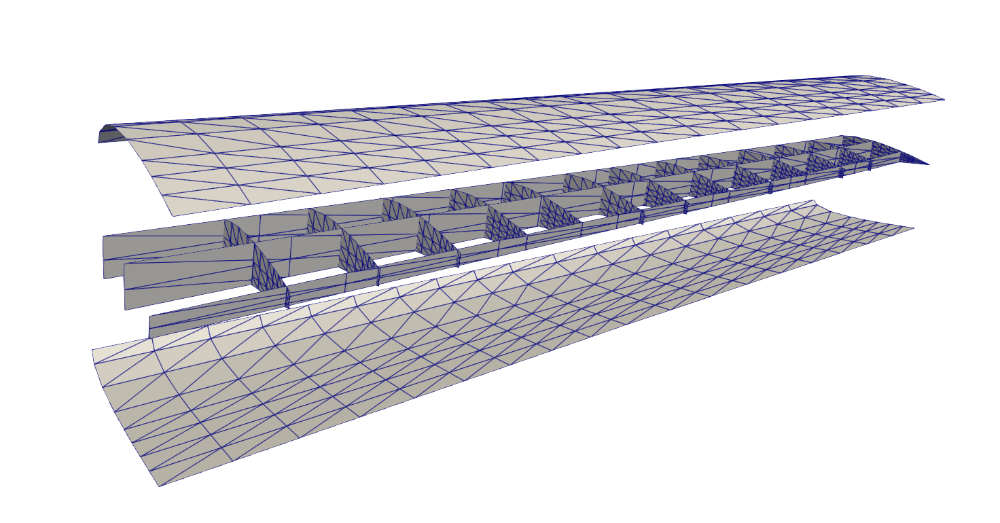
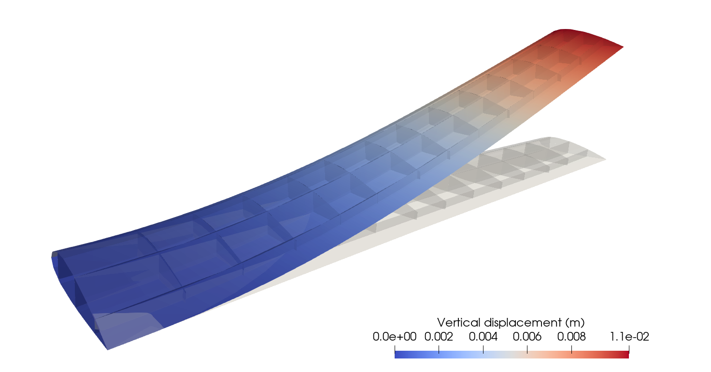
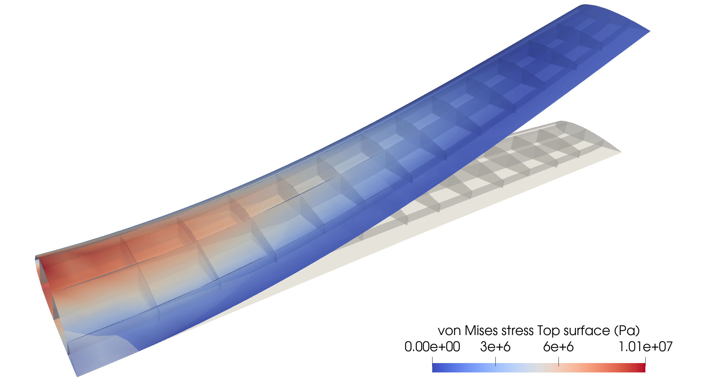

# eVTOL wing
One target application of PENGoLINS is to integrate design and analysis of aerospace structures. We first show the creation of an electric vertical takeoff and landing (eVTOL) aircraft wing geometry with NASA's [OpenVSP](http://openvsp.org/). Then perform structural analysis to compute the stress distribution using PENGoLINS. Full Python file of this demo is implemented [here](https://github.com/hanzhao2020/PENGoLINS/blob/main/demos/eVTOL/evtol_wing.py).

## Design of eVTOL wing geometry
[OpenVSP](http://openvsp.org/) is a geometry tool that allows users to generate aircraft components, such as fuselages, wings, and pods, by adjusting design parameters. We start with an existing eVTOL geometry eCRM-002, which can be obtained from the public database [VSP Hangar](http://hangar.openvsp.org/), to get the outer skin of the wing. A screenshot of the eCRM-002 in OpenVSP, and its associated geometry browser and wing design interface are shown below. 
<p align="center">
  
  
  
</p>

Although OpenVSP is a powerful geometry design software, it doesn't provide the functionality to specify internal stiffeners for aircraft. Therefore, we use an auxiliary geometry tool that creates NURBS surfaces to represent ribs and spars of the eVTOL wing, so that the stress analysis is more practically meaningful. We introduce 3 spars and 12 ribs using the auxiliary tool for one wing. The exported eVTOL geometry with internal structures can be downloaded [here](https://drive.google.com/file/d/1xpY8ACQlodmwkUZsiEQvTZPcUu-uezgi/view?usp=sharing) in igs format. Moving the geometry to the current directory, we can proceed with the structural analysis.

## Geometry preprocessing
To begin with, we import ``PENGoLINS.occ_preprocessing`` for the preprocessing of geometry and ``PENGoLINS.nonmatching_coupling`` for analysis.
```python
from PENGoLINS.occ_preprocessing import *
from PENGoLINS.nonmatching_coupling import *
```
Define material and geometric parameters, spline order, and penalty coefficient.
```python
# Scale down the geometry using ``geom_scale``to make the length 
# of the wing in the span-wise direction is around 5 m.
geom_scale = 2.54e-5  # Convert current length unit to m
E = Constant(68e9)  # Young's modulus, Pa, assuming aluminum
nu = Constant(0.35)  # Poisson's ratio
h_th = Constant(3.0e-3)  # Thickness of surfaces, m
p = 3  # spline order
penalty_coefficient = 1.0e3
```
Now, we import the downloaded igs file and convert them to OCC recognizable B-spline surface instances.
```python
print("Importing geometry...")
filename_igs = "eVTOL_wing_structure.igs"
# Read the igs file into current process and treat the geometry
# as a list of topological shapes by setting ``as_compound``
# to ``False``.
igs_shapes = read_igs_file(filename_igs, as_compound=False)
# Convert the topological shapes to B-spline surfaces that 
# can be recognized by pythonOCC.
evtol_surfaces = [topoface2surface(face, BSpline=True) 
                  for face in igs_shapes]
```
The python list ``evtol_surfaces`` contains all patches of the aircraft. Since we want to perform analysis for the wing only, the next step is to isolate the NURBS surfaces of the wing and its internal structures by specifying their indices. 21 NURBS surfaces are selected for analysis in this demo.
```python
# Outer skin indices: list(range(12, 18))
# Spars indices: [78, 92, 79]
# Ribs indices: list(range(80, 92))
wing_indices = list(range(12, 18)) + [78, 92, 79]  + list(range(80, 92))
wing_surfaces = [evtol_surfaces[i] for i in wing_indices]
num_surfs = len(wing_surfaces)
```
Before running the analysis, it's nontrivial to check the continuity of the NURBS surfaces so that all patches are sufficiently smooth to apply the Kirchhoff--Love shell formulation, which requires $C^1$ continuity. Looking at the knots vectors of NURBS surfaces in ``wing_surfaces``, the excessive multiplicity of interior knots leads to $C^0$ continuity of basis functions. Therefore, we need to reconstruct the wing surfaces using the least-square fit method, which is provided by pythonOCC, to generate analysis-suitable geometry.
```python
# To reparametrize the wing surfaces, we fist evaluate a list of 
# points on them and use their locations to construct new NURBS 
# patches with maximal continuity.
# Number of points to evaluate in one direction.
num_pts_eval = [16]*num_surfs
# Number of knots to insert in u and v parametric directions at 
# the first refinement level.
u_insert_list = [8]*num_surfs
v_insert_list = [8]*num_surfs
# Refinement level for each patch.
ref_level_list = [1]*num_surfs
# For the two small NURBS patches at the wingtip, we control the
# refinement level less than 3 to prevent over refinement.
for i in [4,5]:
    if ref_level_list[i] > 4:
        ref_level_list[i] = 2
    elif ref_level_list[i] <=4 and ref_level_list[i] >= 1:
        ref_level_list[i] = 1
# Number of knots to insert.
u_num_insert = []
v_num_insert = []
for i in range(len(u_insert_list)):
    u_num_insert += [ref_level_list[i]*u_insert_list[i]]
    v_num_insert += [ref_level_list[i]*v_insert_list[i]]
```
Initializing the preprocessing instance by passing list ``wing_surfaces`` to ``OCCPreprocessing`` and setting both arguments ``reparametrize`` and ``refine`` as ``True``.
```python
preprocessor = OCCPreprocessing(wing_surfaces, reparametrize=True, 
                                refine=True)
```
Then we can use the defined lists ``num_pts_eval``, ``u_num_insert``, and ``v_num_insert`` to reconstruct and refine the NURBS surfaces. ``geom_scale`` is used to convert the length unit. Reconstructed NURBS surfaces could have densely distributed knots, which can be removed by setting ``remove_dense_knots`` as True with tolerance ``rtol``. The knots may not be successfully removed if the tolerance is too small, or the reconstructed surfaces may change to strange shapes if the tolerance is too large. For a detailed explanation of each argument, please refer to the help information of the following methods.
```python
preprocessor.reparametrize_BSpline_surfaces(num_pts_eval, num_pts_eval,
                                            geom_scale=geom_scale,
                                            remove_dense_knots=True,
                                            rtol=1e-4)
preprocessor.refine_BSpline_surfaces(p, p, u_num_insert, v_num_insert, 
                                     correct_element_shape=True)
```
And the last but important step in preprocessing is to compute the surface-surface intersections and obtain related data. This can be done using method ``compute_intersections`` in ``preprocessor``. We set ``mortar_refine`` equals 2 so that the default numbers of elements for mortar meshes will be doubled, which will improve the stress distribution quality near the intersection.
```python
preprocessor.compute_intersections(mortar_refine=2)
```
We can print out necessary information such as total DoFs and number of intersections:
```python
if mpirank == 0:
    print("Total DoFs:", preprocessor.total_DoFs)
    print("Number of intersections:", preprocessor.num_intersections_all)
```
There are 5904 DoFs in total and 87 intersections in the wing geometry.

Users can choose to visualize the reconstructed NURBS patches and intersections using the following code:
```python
display, start_display, add_menu, add_function_to_menu = init_display()
preprocessor.display_surfaces(display, save_fig=True)
preprocessor.display_intersections(display, save_fig=True)
```
Figures of reparametrized eVOTL wing and intersections are shown below:
<p align="center">
  
  
</p>
The following figure displays exploded view of the eVTOL wing geometry, where the lower and upper surfaces are transformed vertically to show the internal stiffeners.
<p align="center">
  
</p>

## Analysis of eVTOL wing

We now have access to all the geometry information to perform analysis for the eVTOL wing. The starting point is creating tIGAr extracted splines for all the OCC NURBS surfaces. Therefore, the following functions are defined to set clamped boundary conditions and create extracted splines, respectively.
```python
def clampedBC(spline_generator, side=0, direction=0):
    """
    Apply clamped boundary condition to spline.
    """
    for field in [0,1,2]:
        scalar_spline = spline_generator.getScalarSpline(field)
        side_dofs = scalar_spline.getSideDofs(direction, side, nLayers=2)
        spline_generator.addZeroDofs(field, side_dofs)

def OCCBSpline2tIGArSpline(surface, num_field=3, quad_deg_const=4, 
                        setBCs=None, side=0, direction=0, index=0):
    """
    Generate ExtractedBSpline from OCC B-spline surface.
    """
    quad_deg = surface.UDegree()*quad_deg_const
    DIR = SAVE_PATH+"spline_data/extraction_"+str(index)+"_init"
    # spline = ExtractedSpline(DIR, quad_deg)
    spline_mesh = NURBSControlMesh4OCC(surface, useRect=False)
    spline_generator = EqualOrderSpline(worldcomm, num_field, spline_mesh)
    if setBCs is not None:
        setBCs(spline_generator, side, direction)
    spline_generator.writeExtraction(DIR)
    spline = ExtractedSpline(spline_generator, quad_deg)
    return spline
```
The created instances of tIGAr extracted spline are stored in a list, where the clamped boundary conditions are applied to the first two patches (the upper and lower surfaces near the wing root).
```python
# Create tIGAr extracted spline instances
splines = []
for i in range(num_surfs):
    if i in [0, 1]:
        # Apply clamped BC to surfaces near root
        spline = OCCBSpline2tIGArSpline(
                 preprocessor.BSpline_surfs_refine[i], 
                 setBCs=clampedBC, side=0, direction=0)
        splines += [spline,]
    else:
        spline = OCCBSpline2tIGArSpline(
                 preprocessor.BSpline_surfs_refine[i])
        splines += [spline,]
```
Similar to the procedures in benchmark problems, we can initialize the instance of the non-matching problem with the list ``splines`` and set up the mortar meshes using the attributes from ``preprocessor``.
```python
problem = NonMatchingCoupling(splines, E, h_th, nu, comm=worldcomm)
problem.create_mortar_meshes(preprocessor.mortar_nels)
problem.create_mortar_funcs('CG',1)
problem.create_mortar_funcs_derivative('CG',1)
problem.mortar_meshes_setup(preprocessor.mapping_list, 
                            preprocessor.intersections_para_coords, 
                            penalty_coefficient)
```
Considering the length of the wing, we assume the take-off weight for eCRM-002 is 3000 kg. Then the magnitude of the upward distributed load is determined by dividing half of the weight by wing volume.
```python
weight = 3000 # Take-off weight, kg
wing_vol = 0
for i in range(num_surfs):
    wing_vol += assemble(h_th*Constant(1.)*splines[i].dx)
load = Constant(weight/2/wing_vol)  # N/m^3
f1 = as_vector([Constant(0.0), Constant(0.0), load])
```
Using the distributed load to form source terms and, therefore, PDE residuals of St. Venant Kirchhoff constitutive model.
```python
loads = [f1]*num_surfs
source_terms = []
residuals = []
for i in range(num_surfs):
    source_terms += [inner(loads[i], problem.splines[i].rationalize(
        problem.spline_test_funcs[i]))*h_th*problem.splines[i].dx]
    residuals += [SVK_residual(problem.splines[i], problem.spline_funcs[i], 
        problem.spline_test_funcs[i], E, nu, h_th, source_terms[i])]
problem.set_residuals(residuals)
```
Finally, we are ready to perform the linear structural analysis for the eVTOL wing.
```python
problem.solve_linear_nonmatching_problem()
```
Printing the vertical displacement of the trailing edge tip.
```python
right_srf_ind = 3
xi = array([1, 1])
z_disp_hom = eval_func(problem.splines[right_srf_ind].mesh, 
                       problem.spline_funcs[right_srf_ind][2], xi)
w = eval_func(problem.splines[right_srf_ind].mesh, 
              problem.splines[right_srf_ind].cpFuncs[3], xi)
QoI = z_disp_hom/w
print("Trailing edge tip vertical displacement: {:10.8f}.\n".format(QoI))
```
We will get the following output, where the vertical displacement of the trailing edge tip is 0.01025676 m.
```
Trailing edge tip vertical displacement: 0.01025676.
```
Saving displacement functions to pvd files. The vertical displacement distribution of the eVTOL wing is shown below, where the wing displacement is scaled by a factor of 10.
```python
SAVE_PATH = "./"
save_disp = True
if save_disp:
    for i in range(problem.num_splines):
        save_results(splines[i], problem.spline_funcs[i], i, 
                     save_path=SAVE_PATH, folder="results/", 
                     save_cpfuncs=True, comm=worldcomm)
```
<p align="center">
  
</p>

While the shell displacements are available, they can be passed to class ``ShellStressSVK`` in ShNAPr to compute the von Mises stresses. Since we are doing the linear structural analysis, the argument ``linearize`` has to be ``True``. ``G_det_min`` is the minimum determinant value of metric tensor, passing a value that is a bit larger than 0 helps reduce stress concentration near the surface singularities. The stresses at the positive half thickness surfaces along through thickness coordinate are computed, and figure of von Mises stress distribution is attached.
```python
von_Mises_tops = []
for i in range(problem.num_splines):
    spline_stress = ShellStressSVK(problem.splines[i], 
                                   problem.spline_funcs[i],
                                   E, nu, h_th, linearize=True, 
                                   G_det_min=5e-2)
    # von Mises stresses on top surfaces
    von_Mises_top = spline_stress.vonMisesStress(h_th/2)
    von_Mises_top_proj = problem.splines[i].projectScalarOntoLinears(
                         von_Mises_top, lumpMass=True)
    von_Mises_tops += [von_Mises_top_proj]

save_stress = True
if save_stress:
    for i in range(problem.num_splines):
        von_Mises_tops[i].rename("von_Mises_top_"+str(i), 
                                 "von_Mises_top_"+str(i))
        File(SAVE_PATH+"results/von_Mises_top_"+str(i)+".pvd") \
            << von_Mises_tops[i]
```
<p align="center">
  
</p>