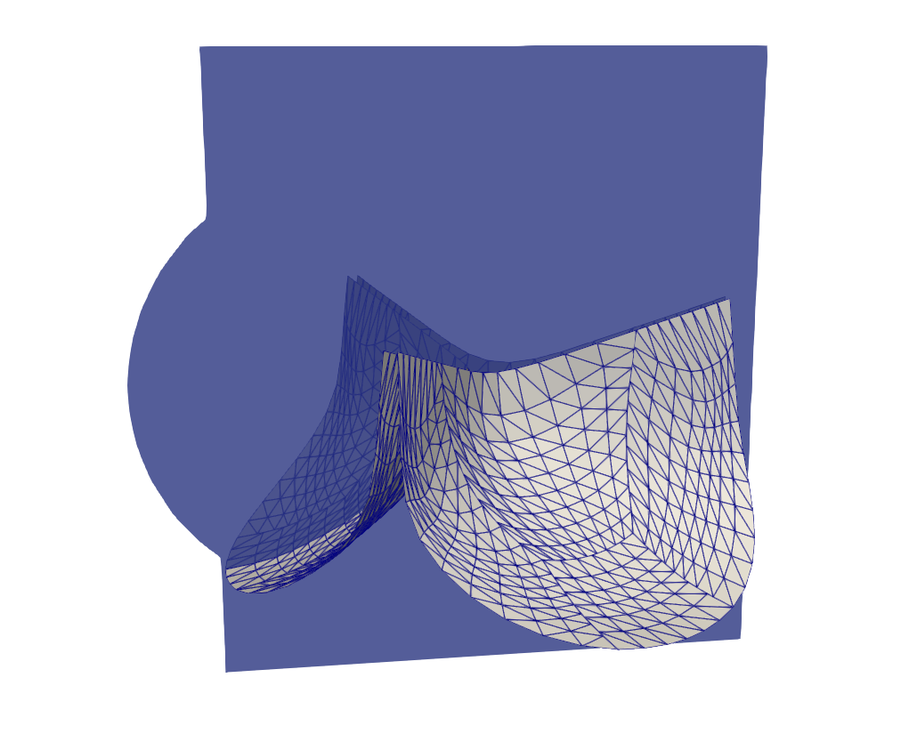
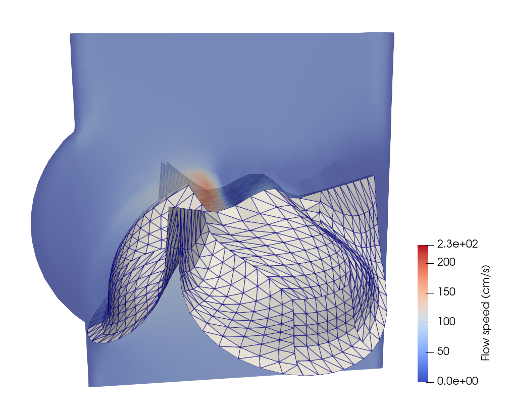
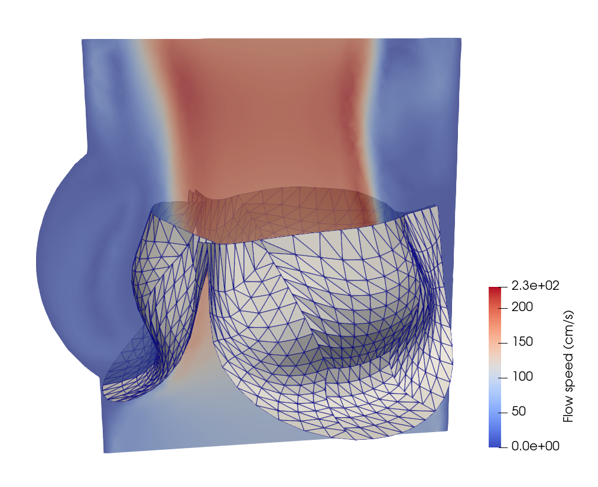
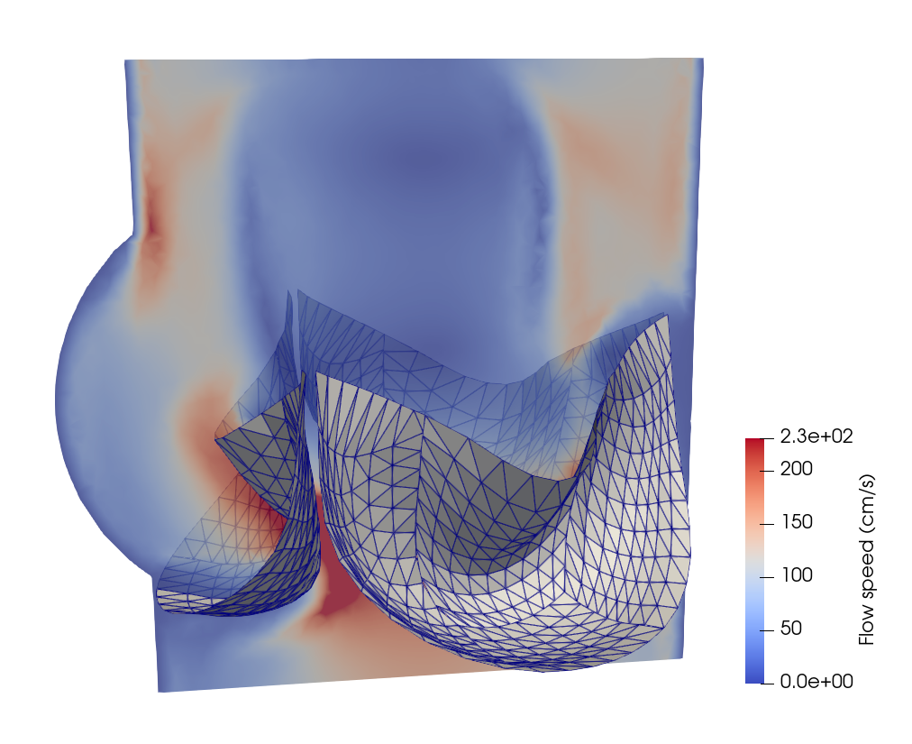
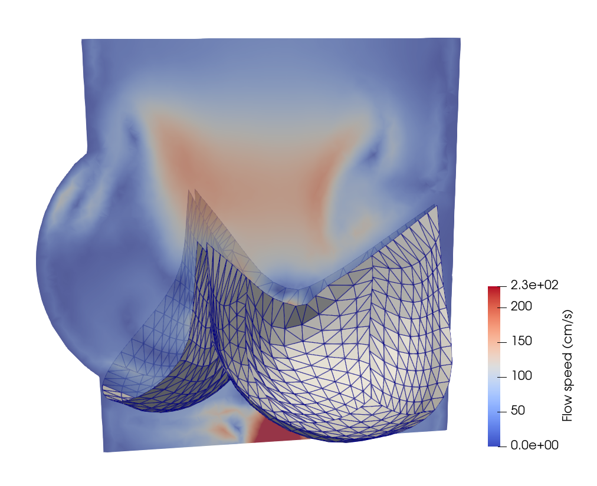

# FSI analysis of prosthetic heart valves
In this section, we will demonstrate the workflow of extending PENGoLINS to fluid-structure interaction (FSI) analysis using the existing open-source FSI framework, [CouDALFISh](https://github.com/david-kamensky/CouDALFISh) and [VarMINT](https://github.com/david-kamensky/VarMINT), while implementation of nonlocal contact is adopted from module [ShNAPr.contact](https://github.com/david-kamensky/ShNAPr/blob/master/ShNAPr/contact.py). A trileaflets heat valve consisting of 12 non-matching NURBS patches is immersed in the fluid mesh, and the pressure at the inflow starts from $2\times10^4$ Ba to simulate systole and changes to $-10^5$ Ba at 0.04s to simulate diastole. The initial configuration is shown in the following figure, where the fluid mesh is represented by a slice of it.

<p align="center">
  
</p>

The FSI analysis of the above heart valve without non-matching intersections using the same modules can be found [here](https://github.com/david-kamensky/CouDALFISh/blob/master/demos/heartValve.py). And the full Python script for this application is available in PENGoLINS [demos](https://github.com/hanzhao2020/PENGoLINS/blob/main/demos/heart-valve/nonmatching_heart_valve.py) repository.

The first step is to define the necessary parameters.
```python
h_th = Constant(0.04)  # Thickness
E = Constant(1e7)
nu = Constant(0.4)
p=3  # B-spline degree
penalty_coefficient = 1.0e3
mortar_refine = 3
```

## Non-matching shells
The non-matching trileaflets heart valve is saved in an igs file, "nonmatching_leafletes.igs", which can be downloaded from [here](https://drive.google.com/file/d/1Adzh5_9AwfEZ9OoXvBPhCmvnPDGBmQ2h/view?usp=sharing). We first use the igs file reader to import it.
```python
filename_igs = "nonmatching_leaflets.igs"
igs_shapes = read_igs_file(filename_igs, as_compound=False)
nonmatching_leaflets = [topoface2surface(face, BSpline=True) 
                        for face in igs_shapes]
num_surfs = len(nonmatching_leaflets)
```
Now, we can use the list of NUBRS patches to initialize the geometry preprocessor and compute the surface-surface intersections.
```python 
preprocessor = OCCPreprocessing(nonmatching_leaflets, 
                                reparametrize=False, refine=True)
preprocessor.refine_BSpline_surfaces(p, p, correct_element_shape=False)
preprocessor.compute_intersections(mortar_refine=mortar_refine)
num_intersections = preprocessor.num_intersections_all
```
Similarly, define functions to create tIGAr extracted spline instances and apply boundary conditions.
```python
def zero_bc(spline_generator, direction=0, side=0, n_layers=2):
    """
    Apply clamped boundary condition to spline.
    """
    for field in [0,1,2]:
        scalar_spline = spline_generator.getScalarSpline(field)
        side_dofs = scalar_spline.getSideDofs(direction, side, 
                                              nLayers=n_layers)
        spline_generator.addZeroDofs(field, side_dofs)

def OCCBSpline2tIGArSpline(surface, num_field=3, quad_deg_const=2, 
                           zero_bcs=None, direction=0, side=0,
                           zero_domain=None, fields=[0,1,2], index=0):
    """
    Convert OCC Geom BSplineSurface to tIGAr ExtractedSpline.
    """
    quad_deg = surface.UDegree()*quad_deg_const
    DIR = SAVE_PATH+"spline_data/extraction_"+str(index)+"_init"
    if path.exists(DIR):
        spline = ExtractedSpline(DIR, quad_deg)
    else:
        spline_mesh = NURBSControlMesh4OCC(surface, useRect=False)
        spline_generator = EqualOrderSpline(selfcomm, num_field, spline_mesh)
        if zero_bcs is not None:
            zero_bcs(spline_generator, direction, side)
        if zero_domain is not None:
            for i in fields:
                spline_generator.addZeroDofsByLocation(zero_domain(), i)
        spline_generator.writeExtraction(DIR)
        spline = ExtractedSpline(spline_generator, quad_deg)
    return spline
```
Create tIGAr extracted spline instances.
```python
splines = []
bcs_funcs = [zero_bc, zero_bc, None, zero_bc]*3
bcs = [[0,0], [0,1], [None, None], [1,1]]*3
for i in range(num_surfs):
    splines += [OCCBSpline2tIGArSpline(preprocessor.BSpline_surfs_refine[i], 
                                       zero_bcs=bcs_funcs[i], 
                                       direction=bcs[i][0], side=bcs[i][1],
                                       index=i),]
```
With the information from the preprocessor and tIGAr extracted splines, we are ready to set up the non-matching problem.
```python
nonmatching_problem = NonMatchingCoupling(splines, E, h_th, nu, 
                                          comm=selfcomm)
nonmatching_problem.create_mortar_meshes(preprocessor.mortar_nels)
nonmatching_problem.mortar_meshes_setup(preprocessor.mapping_list, 
                            preprocessor.intersections_para_coords, 
                            penalty_coefficient)
```

## Nonlocal contact
A crucial component for heart valve FSI simulation is the shell contact. The leaflets would penetrate each other if contact formulation is not considered or well defined. We use the submodule from ShNAPr to define the nonlocal contact problem. Users who are interested in the details of the nonlocal contact formulation can refer to [Kamensky et al](https://doi.org/10.1016/j.cma.2017.11.007).
```python
# The radius defining the reference-configuration neighborhood 
# with which each point does not interact through contact forces
R_self = 0.045
# The maximum range used to identify potentially-contacting 
# points in the current configuration
r_max = 0.035
# Contact stiffness
k_contact = 1e11
# Function of contact forces
def phiPrime(r):
    if(r>r_max):
        return 0.0
    return -k_contact*(r_max-r)
def phiDoublePrime(r):
    if(r>r_max):
        return 0.0
    return k_contact
# Create contact instance
contactContext_sh = ShellContactContext(splines, R_self, r_max, 
                                        phiPrime, phiDoublePrime)
```

## Fluid mesh
For simplicity, we can use functions in the mshr module to create the fluid mesh.
```python
resolution = 70
CYLINDER_RAD = 1.1
BOTTOM = -0.5
TOP = 2.0
tube = Cylinder(Point(0,0,BOTTOM),Point(0,0,TOP),
                CYLINDER_RAD,CYLINDER_RAD)
SINUS_CENTER_FAC = 0.5
SINUS_RAD_FAC = 0.8
SINUS_Z_SHIFT = -0.2
sinusRad = SINUS_RAD_FAC*CYLINDER_RAD
sinusZ = sinusRad + SINUS_Z_SHIFT
for i in range(0,3):
    sinusTheta = math.pi/3.0 + i*2.0*math.pi/3.0
    sinusCenterRad = SINUS_CENTER_FAC*CYLINDER_RAD
    sinusCenter = Point(sinusCenterRad*math.cos(sinusTheta),
                        sinusCenterRad*math.sin(sinusTheta),sinusZ)
    tube += Sphere(sinusCenter,sinusRad)
mesh = generate_mesh(tube, resolution)
```

## Fluid formulation
Implementation of formulation for the fluid mesh takes advantage of the Python module VarMINT, which contains functions to apply the variational multiscale incompressible Navier-Stokes flow. Meanwhile, time integration of both the fluid and structure problems utilizes the generalized-$\alpha$ method, which is already coded in tIGAr.
```python
# Parameters for time integration
rho_inf = Constant(0.0)
total_time = 0.07
delta_t = Constant(1e-4)
n_steps = int((total_time/float(delta_t)))

########### Fluid Formulation ###########
# Set up VMS fluid problem using VarMINT:
VE = VectorElement("Lagrange",mesh.ufl_cell(),1)
QE = FiniteElement("Lagrange",mesh.ufl_cell(),1)
VQE = MixedElement([VE,QE])
V_f = equalOrderSpace(mesh)
Vscalar = FunctionSpace(mesh,"Lagrange",1)
up = Function(V_f)
up_old = Function(V_f)
updot_old = Function(V_f)
vq = TestFunction(V_f)
time_int_f = GeneralizedAlphaIntegrator(rho_inf,delta_t,up,
                                        (up_old,updot_old),t)

# Define traction boundary condition at inflow:
xSpatial = SpatialCoordinate(mesh)
PRESSURE = Expression("((t<0.05)? 2e4 : -1e5)",t=0.0,degree=1)
inflowChar = conditional(lt(xSpatial[2],BOTTOM+1e-3),1.0,Constant(0.0))
inflowTraction = as_vector((0.0,0.0,PRESSURE))*inflowChar

def uPart(up):
    return as_vector([up[0],up[1],up[2]])

quadDeg = 2
dx_f = dx(metadata={"quadrature_degree":quadDeg})
ds_f = ds(metadata={"quadrature_degree":quadDeg})
rho = Constant(1.0)
mu = Constant(3e-2)
up_alpha = time_int_f.x_alpha()
u_alpha = uPart(up_alpha)
p = time_int_f.x[3]
v,q = split(vq)
up_t = time_int_f.xdot_alpha()
u_t = uPart(up_t)
cutFunc = Function(Vscalar)
stabEps = 1e-3
res_f = interiorResidual(u_alpha,p,v,q,rho,mu,mesh,v_t=u_t,Dt=delta_t,dy=dx_f,
                         stabScale=stabScale(cutFunc,stabEps))
n = FacetNormal(mesh)
res_f += stableNeumannBC(inflowTraction,rho,u_alpha,v,n,
                         ds=ds_f,gamma=Constant(1.0))

bcs_f = [DirichletBC(V_f.sub(0), Constant(d*(0.0,)),
                     (lambda x, on_boundary :
                      on_boundary and
                      math.sqrt(x[0]*x[0]+x[1]*x[1])>0.98*CYLINDER_RAD)),]

# Form to evaluate net inflow:
u = uPart(up)
netInflow = -inflowChar*dot(u,n)*ds_f
```

## Shell formulation
Next, we use an identical workflow to formulate the shell problem.
```python
########### Shell formulation ###########
dens = Constant(1.)  # Density
y_old_hom_list = []
ydot_old_hom_list = []
yddot_old_hom_list = []
time_int_shs = []
y_alpha_list = []
ydot_alpha_list = []
yddot_alpha_list = []
# Time integrators
for i in range(num_surfs):
    y_old_hom_list += [Function(nonmatching_problem.splines[i].V)]
    ydot_old_hom_list += [Function(nonmatching_problem.splines[i].V)]
    yddot_old_hom_list += [Function(nonmatching_problem.splines[i].V)]
    time_int_shs += [GeneralizedAlphaIntegrator(rho_inf, delta_t, 
        nonmatching_problem.spline_funcs[i], (y_old_hom_list[i], 
        ydot_old_hom_list[i], yddot_old_hom_list[i]), 
        t=t, useFirstOrderAlphaM=True),]
    y_alpha_list += [nonmatching_problem.splines[i].rationalize(
                     time_int_shs[i].x_alpha())]
    ydot_alpha_list += [nonmatching_problem.splines[i].rationalize(
                        time_int_shs[i].xdot_alpha())]
    yddot_alpha_list += [nonmatching_problem.splines[i].rationalize(
                        time_int_shs[i].xddot_alpha())]
# Shell residuals
res_shs = []
for i in range(num_surfs):
    dW = Constant(1./time_int_shs[i].ALPHA_F)\
         *SVK_residual(nonmatching_problem.splines[i],
         nonmatching_problem.spline_funcs[i], 
         nonmatching_problem.spline_test_funcs[i], E, nu, h_th, 0)
    dMass = dens*h_th*inner(yddot_alpha_list[i], 
            nonmatching_problem.spline_test_funcs[i])\
            *nonmatching_problem.splines[i].dx
    res_shs += [dW+dMass]
```

## FSI problem
Now that the fluid and shell problems are well defined, we can begin to initialize the FSI problem using CouDALFISh. A nontrivial effort is to configure the linear solver carefully for the 3D fluid problem, where a direct solver usually works slowly. In this application, we choose GMRES with a Jacobi preconditioner to solve the fluid sub-problem.
```python
# Linear solver for fluid sub-problem
fluidLinearSolver = PETScKrylovSolver("gmres","jacobi")
fluidLinearSolver.parameters["error_on_nonconvergence"] = False
fluidLinearSolver.ksp().setNormType(PETSc.KSP.NormType.UNPRECONDITIONED)
fluidKSPrtol = 1e-2
maxKSPIt = 300
fluidLinearSolver.ksp().setTolerances(rtol=fluidKSPrtol,max_it=maxKSPIt)
fluidLinearSolver.ksp().setGMRESRestart(maxKSPIt)
```
And define the FSI problem with CouDALFISh.
```python
DAL_penalty = 5e2
DAL_r = 1e-5
blockItTol = 1e-2
fsi_problem = CouDALFISh(mesh,res_f,time_int_f,
                         splines,res_shs,time_int_shs,
                         DAL_penalty,r=DAL_r,
                         bcs_f=bcs_f,
                         blockItTol=blockItTol,
                         contactContext_sh=contactContext_sh,
                         nonmatching_sh=nonmatching_problem,
                         fluidLinearSolver=fluidLinearSolver,
                         cutFunc=cutFunc)
```
Lastly, we can start the time stepping loop of the FSI problem.
```python
for time_step in range(start_step, n_steps):
    # Update pressure
    PRESSURE.t = time_int_f.t-(1.0-float(time_int_f.ALPHA_M))*float(delta_t)
    fsi_problem.takeStep()
    flow_rate = assemble(netInflow)
```

Implementation details of writing out results and restart files are neglected in this documentation for conciseness, but they can be found in the full Python script. A few snapshots of the heart valve at the 120th, 350th, 450th and 490th steps are shown below.
<p align="center">
  
  
  
  
</p>