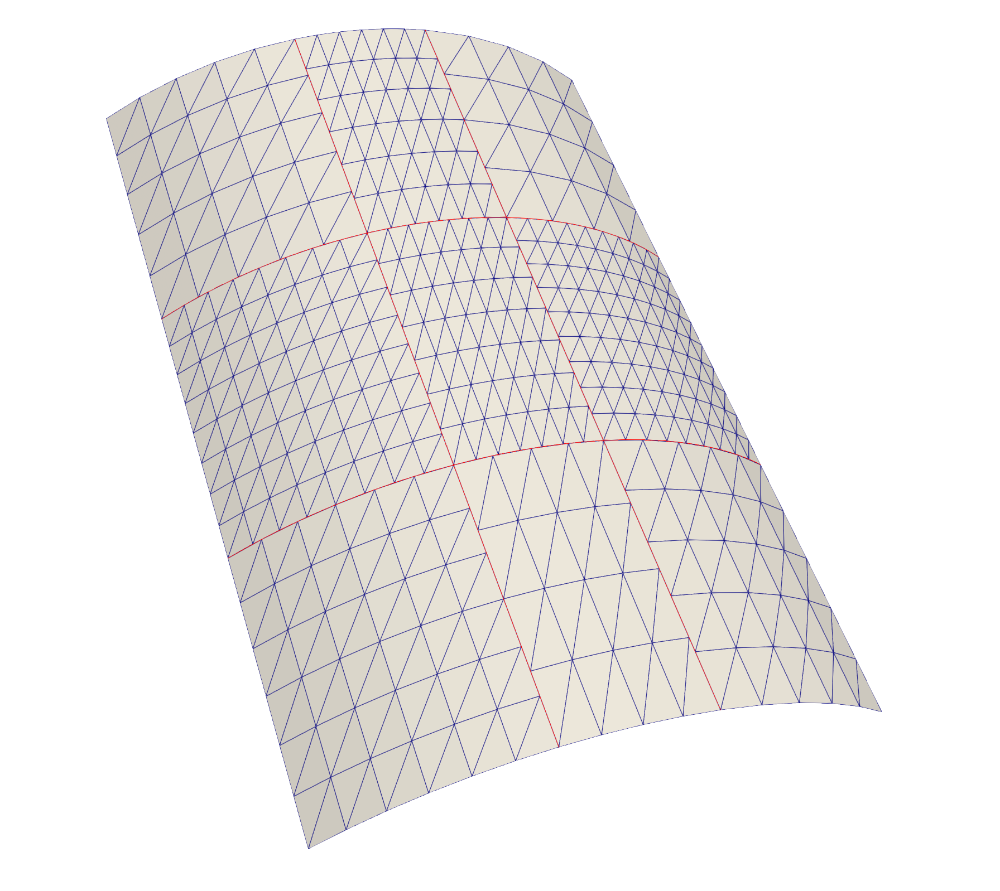
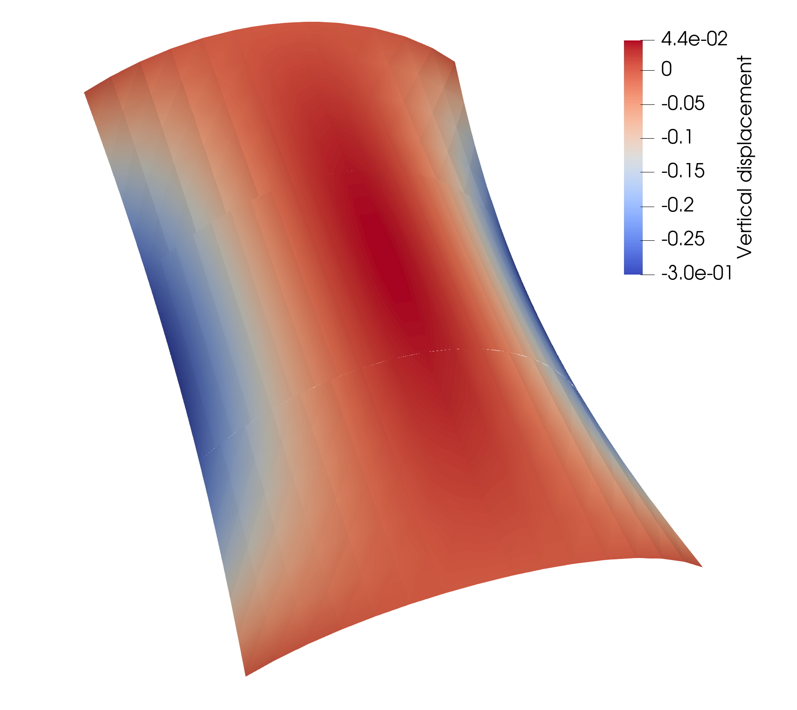

# Scordelis-Lo roof
This demo solves the Scordelis-Lo roof under self-weight, the definition of the problem can be found in Section 3.1 of [Herrema et al.](https://doi.org/10.1016/j.cma.2018.08.038). Scordelis-Lo roof geometry consisting of 9 non-matching patches is shown in the following figure, where non-matching intersections are marked by red curves. Single patch Scordelis-Lo roof benchmark test is implemented in [here](https://github.com/david-kamensky/ShNAPr/blob/master/demos/ScordelisLo.py) using [ShNAPr](https://github.com/david-kamensky/ShNAPr). 
<p align="center">
  
</p>
To begin with, importing related libraries. We use [igakit](https://bitbucket.org/dalcinl/igakit/src/master/) to create the simple surface geometries.

```python
from tIGAr.NURBS import *
from PENGoLINS.nonmatching_coupling import *
from PENGoLINS.igakit_utils import *
```
Then define geometric parameters.
```python
# Define geometric parameters
num_srf = 9  # Number of spline patches
h_th = Constant(0.25)  # Shell thickness
L = 50.0  # Scordelis-Lo roof length
R = 25.0  # Scordelis-Lo roof radius
angles = [50, 80, 100, 130]  # Central angles in degree
z_lims = [0, L/4, 3*L/4, L]
angle_lim_list = [angles[0:2], angles[1:3], angles[2:4]]*3
z_lim_list = [z_lims[0:2]]*3 + [z_lims[1:3]]*3 + [z_lims[2:4]]*3
# Numbers of elements and degree for NURBS patches on one side
num_el = 6
num_el0 = num_el
num_el1 = num_el - 2
num_el2 = num_el - 1
num_el3 = num_el + 2
num_el4 = num_el + 1
num_el5 = num_el + 3
num_el6 = num_el - 1
num_el7 = num_el
num_el8 = num_el - 2
spline_nels = [num_el0, num_el1, num_el2, 
               num_el3, num_el4, num_el5, 
               num_el6, num_el7, num_el8]
p = 3  # NURBS degree
```
Define material paramters.
```python
# Define material parameters
E = Constant(4.32e8)  # Young's modulus
nu = Constant(0.0)  # Poisson's ratio
```
Define load condition and penalty coefficient.
```python
# Define load condition
areal_force_density = Constant(90.0)
f = as_vector([Constant(0.0), -areal_force_density, Constant(0.0)])
penalty_coefficient = 1.0e3
```
Next, define a function to create all NURBS patches that have different discretizations and put them in a list.
```python
# Define a function to create NURBS surfaces of Scordelis-Lo roof
def create_roof_srf(num_el, p, R, angle_lim=[50,130], z_lim=[0,1]):
    angle = (math.radians(angle_lim[0]), math.radians(angle_lim[1]))
    C = circle(center=[0,0,z_lim[0]], radius=R, angle=angle)
    T = circle(center=[0,0,z_lim[1]], radius=R, angle=angle)
    S = ruled(C,T)
    deg1, deg2 = S.degree
    S.elevate(0, p-deg1)
    S.elevate(1, p-deg2)
    new_knots = np.linspace(0, 1, num_el+1)[1:-1]
    S.refine(0, new_knots)
    S.refine(1, new_knots)
    return S
# Create igakit NURBS instances for each patch
nurbs_srfs = []
for i in range(num_srf):
    nurbs_srfs += [create_roof_srf(spline_nels[i], p, R, 
                                   angle_lim_list[i], z_lim_list[i])]
```
Once the list of igakit NURBS patches is available, we continue to create tIGAr extracted splines before performing IGA. We wrap the procedures that create tIGAr extracted splines and set up Dirichlet boundary conditions into the following function:
```python
def create_spline(srf, num_field=3, BCs=[1,1], fix_z_node=False):
    spline_mesh = NURBSControlMesh(srf, useRect=False)
    spline_generator = EqualOrderSpline(worldcomm, num_field, spline_mesh)
    # Set Dirichlet boundary conditions. All Dirichlet boundaries 
    # are along with v (index 1) parametric direction in this demo.
    # For the side i (i = {0,1}) in the v parametric direction, 
    # if ``BCs[i]`` is 1, set zero displacements to the first
    # layer of control points in x and y fields.
    for field in range(0,2):
        scalar_spline = spline_generator.getScalarSpline(field)
        parametric_direction = 1
        for side in [0,1]:
            side_dofs = scalar_spline.getSideDofs(parametric_direction, side)
            if BCs[side] == 1:
                spline_generator.addZeroDofs(field, side_dofs)

    if fix_z_node:
        # Pin z displacement for one control point to eliminate rigid mode.
        field = 2
        spline_generator.addZeroDofs(field, [0,])

    quad_deg = 2*srf.degree[0]
    spline = ExtractedSpline(spline_generator, quad_deg)
    return spline
```
Converting igakit NURBS instances to tIGAr extracted splines using the function ``create_spline``.
```python
bc0 = [1, 0]
bc1 = [0, 0]
bc2 = [0, 1]
bcs_list = [bc0]*3 + [bc1]*3 + [bc2]*3
splines = []
for i in range(num_srf):
    if i == 0:
        # Fix z displacement for one patch to eliminate rigid mode.
        splines += [create_spline(nurbs_srfs[i], BCs=bcs_list[i], 
                                 fix_z_node=True),]
    else:
        splines += [create_spline(nurbs_srfs[i], BCs=bcs_list[i]),]
```
Now, we can initialize the non-matching problem with the list of tIGAr extracted splines.
```python
problem = NonMatchingCoupling(splines, E, h_th, nu, comm=worldcomm)
```
In the benchmark problems, we mannually configure the mortar meshes so that the coupling methodology of PENGoLINS is more transparent to users. 
```python
# Define a python list ``mapping_list``, whose element contains two 
# indices of spline patches have at least one intersection. If two (i, j) 
# spline patches have n intersections, the corresponding element [i, j]
# repeats n times in the ``mapping_list``.
mapping_list = [[0,1],[1,2],[3,4],[4,5],[6,7],[7,8],
                [0,3],[3,6],[1,4],[4,7],[2,5],[5,8]]
num_interfaces = len(mapping_list)
# Define parametric locations for each mortar mesh
h_mortar_locs = [np.array([[0., 1.], [1., 1.]]), 
                 np.array([[0., 0.], [1., 0.]])]
v_mortar_locs = [np.array([[1., 0.], [1., 1.]]),
                 np.array([[0., 0.], [0., 1.]])]
mortar_nels = []
mortar_mesh_locations = []
for j in range(num_interfaces):
    mortar_nels += [3*(spline_nels[mapping_list[j][0]]\
                    +spline_nels[mapping_list[j][1]])]
    if j < 6:
        mortar_mesh_locations += [v_mortar_locs]
    else:
        mortar_mesh_locations += [h_mortar_locs]
```
Create mortar meshes and set up coupling information. In practical applications, the required arguments ``mortar_nels``, ``mapping_list``, and ``mortar_mesh_locations`` would be generated automatically by the PENGoLINS preprocessor.
```python
problem.create_mortar_meshes(mortar_nels)
problem.create_mortar_funcs('CG',1)
problem.create_mortar_funcs_derivative('CG',1)
problem.mortar_meshes_setup(mapping_list, mortar_mesh_locations, 
                            penalty_coefficient)
```
We proceed with creating PDE residuals for all spline patches using St. Venant-Kirchhoff constitutive model.
```python
source_terms = []
residuals = []
for i in range(len(splines)):
    source_terms += [inner(f, problem.splines[i].rationalize(
    problem.spline_test_funcs[i]))*problem.splines[i].dx]
    residuals += [SVK_residual(problem.splines[i], problem.spline_funcs[i], 
        problem.spline_test_funcs[i], E, nu, h_th, source_terms[i])]
problem.set_residuals(residuals)
```
Finally, we can solve the linearized Scordelis-Lo roof problem. The default solver type is "direct", users may use PETSc Krylov solver "ksp" or customized solver.
```python
problem.solve_linear_nonmatching_problem(solver="direct")
```
To verify the results, we print out the quantity of interest (QoI), which is the vertical displacement at the midpoint point on the free edge, and compare it with the reference value 0.3006.
```python
# Check the quantity of interest on both free edges
xi_list = [array([0.0, 0.5]), array([1.0, 0.5])]
spline_inds = [3,5]
for j in range(len(spline_inds)):
    xi = xi_list[j]
    # Vertical displacement in homogeneous coordinate
    disp_y_hom = eval_func(problem.splines[spline_inds[j]].mesh, 
                        problem.spline_funcs[spline_inds[j]][1], xi)
    # Weight
    w = eval_func(problem.splines[spline_inds[j]].mesh, 
                    problem.splines[spline_inds[j]].cpFuncs[3], xi)
    QoI_temp = -disp_y_hom/w
    print("Quantity of interest for patch {} = {:10.8f}"
          " (Reference value = 0.3006).".format(j, QoI_temp))
```
The printed QoI in this benchmark test:
```
Quantity of interest for patch 3 = 0.30060742 (Reference value = 0.3006).
Quantity of interest for patch 5 = 0.30060117 (Reference value = 0.3006).
```
It's recommended to use ParaView for results visualization. The solutions can be saved to pvd files and rendered by ParaView.
```python
SAVE_PATH = "./"
for i in range(problem.num_splines):
    save_results(splines[i], problem.spline_funcs[i], i, 
                 save_cpfuncs=True, save_path=SAVE_PATH, comm=problem.comm)
```
The vertical displacement of Scordelis-Lo roof, using a scale factor of 10, is shown in the following figure. The full python file for this demo can be found in [here](https://github.com/hanzhao2020/PENGoLINS/blob/main/demos/Scordelis-Lo/Scordelis_Lo.py).
<p align="center">
  
</p>