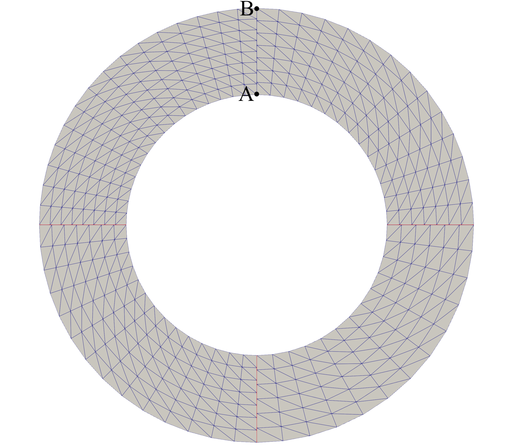
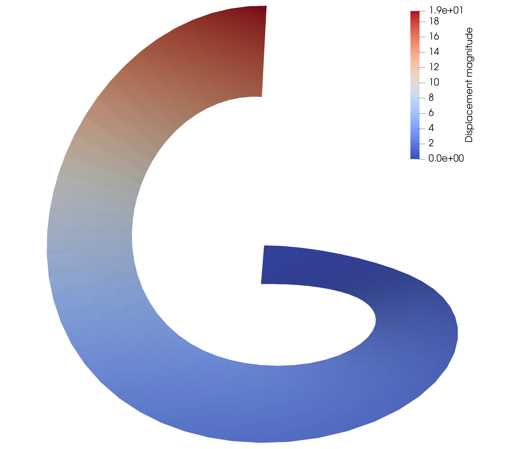

# Nonlinear analysis of a slit annular plate
This demo performs geometrically nonlinear analysis of a slit annular plate. The plate is subjected to a vertical line force along one side of the slit, with a maximum magnitude of 0.8 per unit length. The other side of the slit is clamped. Full implementation of this demo can be found in this [Python file](https://github.com/hanzhao2020/PENGoLINS/blob/main/demos/slit-annular/slit_annular.py). The slit annular plate geometry is shown in the following figure, where red lines indicate the non-matching intersections. Points A and B are the locations to measure vertical displacements and compare them with reference values, reported in [Sze et al.](https://doi.org/10.1016/j.finel.2003.11.001) Table 4.
<p align="center">
  
</p>
Firstly, import necessary libraries, define material and geometric parameters. We use a stepping load that gradually increased to maximum force density to improve Newton iteration's convergence. The solutions of current force density are the initial guess for the next load step.

```python
from tIGAr.NURBS import *
from PENGoLINS.nonmatching_coupling import *
from PENGoLINS.igakit_utils import *

E = Constant(21e6)
nu = Constant(0.0)
h_th = Constant(0.03)
line_force = Constant(0.8) # N/m

p = 3  # NURBS degree
num_srfs = 4
num_el = 8
num_els = [num_el, num_el-1, num_el-2, num_el-1]
# Use the load stepping to improve convergence
load_step = 50
line_force_ratio = np.linspace(1/load_step, 1, load_step)
penalty_coefficient = 1.0e3
``` 
Define the functions to create igakit NURBS surfaces of the annulus sector and tIGAr extracted spline instances.
```python
# Function to create slit annular plate surface geometry
def create_srf(num_el_r, num_el_alpha, p=3, Ri=6, Ro=10, angle_lim=[0,90]):
    angle = (math.radians(angle_lim[0]), math.radians(angle_lim[1]))
    Ci = circle(center=[0,0,0], radius=Ri, angle=angle)
    Co = circle(center=[0,0,0], radius=Ro, angle=angle)
    S = ruled(Ci,Co)
    deg1, deg2 = S.degree
    S.elevate(0,p-deg1)
    S.elevate(1,p-deg2)
    new_knots_r = np.linspace(0,1,num_el_r+1)[1:-1]
    new_knots_alpha = np.linspace(0,1,num_el_alpha+1)[1:-1]
    S.refine(0,new_knots_alpha)
    S.refine(1,new_knots_r)
    return S
# Function to create tIGAr extracted spline
def create_spline(srf, num_field=3, BCs=[0,0], fix_z_node=False):
    spline_mesh = NURBSControlMesh(srf, useRect=False)
    spline_generator = EqualOrderSpline(worldcomm, num_field, spline_mesh)
    # Set Dirichlet boundary condition
    for field in range(3):
        scalar_spline = spline_generator.getScalarSpline(field)
        parametric_direction = 0
        for side in [0,1]:
            # Clamped boundary
            side_dofs = scalar_spline.getSideDofs(parametric_direction, 
                                                  side, nLayers=2)
            if BCs[side] == 1:
                spline_generator.addZeroDofs(field, side_dofs)

    quad_deg = 2*srf.degree[0]
    spline = ExtractedSpline(spline_generator, quad_deg)
    return spline
```
Use the functions defined above to generate NURBS geometries and extracted splines for analysis.
```python
nurbs_srfs = []
splines = []
BCs_list = [[0,0], [0,0], [0,0], [0,1]]

for i in range(num_srfs):
    nurbs_srfs += [create_srf(num_els[i], num_els[i]*2, 
                              angle_lim=[360/num_srfs*i, 
                                         360/num_srfs*(i+1)])]
    splines += [create_spline(nurbs_srfs[-1], BCs=BCs_list[i])]
```
Now, we can initialize the non-matching problem with class ``NonMatchingCoupling`` since the list of extracted splines is available.
```python
problem = NonMatchingCoupling(splines, E, h_th, nu, comm=worldcomm)
```
Likewise, we need to compute the ``mapping_list`` and mortar meshes' parametric locations, which are manually defined in the benchmark problems but will be automatically computed in practical applications.
```python
# Define ``mapping_list`` that contains the information of coupled 
# NURBS patches, length of ``mapping_list`` is the number of 
# intersections in the geometry.
mapping_list = [[0,1], [1,2], [2,3]]
num_mortar_mesh = len(mapping_list)
mortar_nels = []
mortar_mesh_locations = []
# Parametric locations of mortar mesh
v_mortar_locs = [np.array([[1., 0.], [1., 1.]]),
                 np.array([[0., 0.], [0., 1.]])]

for i in range(num_mortar_mesh):
    mortar_nels += [num_els[i]*2,]
    # All (three) mortar meshes have same parametric locations 
    # in this demo
    mortar_mesh_locations += [v_mortar_locs,]
```
We can then pass the above information to ``problem`` to finish the setup of mortar meshes.
```python
problem.create_mortar_meshes(mortar_nels)
problem.create_mortar_funcs('CG',1)
problem.create_mortar_funcs_derivative('CG',1)
problem.mortar_meshes_setup(mapping_list, mortar_mesh_locations,
                            penalty_coefficient)
```
In this demo, a line force is applied to the free end of the slit annular plate. We have to mark this end before constructing source terms and PDE residuals. The free end on ``problem.splines[0]`` is marked using its parametric location, where the first parametric coordinate is near 0.
```python
# Apply load to the right end boundary
class loadBoundary(SubDomain):
    def inside(self, x, on_boundary):
        return near(x[0], 0.0) and on_boundary

load_srf_ind = 0
left = loadBoundary()
spline_boundaries1 = MeshFunction("size_t", 
    problem.splines[load_srf_ind].mesh, 1)
spline_boundaries1.set_all(0)
left.mark(spline_boundaries1, 1)
problem.splines[load_srf_ind].ds.setMarkers(markers=spline_boundaries1)
```
We also create the empty pvd files to store solutions before the stepping load.
```python
SAVE_PATH = "./"
u_file_names = []
u_files = []
F_file_names = []
F_files = []
for i in range(num_srfs):
    u_file_names += [[],]
    u_files += [[],]
    F_file_names += [[],]
    F_files += [[],]
    for j in range(3):
        u_file_names[i] += [SAVE_PATH+"results/"+"u"+str(i)
                            +"_"+str(j)+"_file.pvd",]
        u_files[i] += [File(problem.comm, u_file_names[i][j]),]
        F_file_names[i] += [SAVE_PATH+"results/"+"F"+str(i)
                            +"_"+str(j)+"_file.pvd",]
        F_files[i] += [File(problem.comm, F_file_names[i][j]),]
        if j == 2:
            F_file_names[i] += [SAVE_PATH+"results/"+"F"
                                +str(i)+"_3_file.pvd",]
            F_files[i] += [File(problem.comm, F_file_names[i][3]),]
```
Now, we can start the stepping loop and save the initial configuration.
```python
WA_list = [] # List for vertical displacement at point A
WB_list = [] # List for vertical displacement at point B

for nonlinear_test_iter in range(load_step):
    print("------------ Iteration:", nonlinear_test_iter, "-------------")
    print("Line force density ratio:", line_force_ratio[nonlinear_test_iter])
    # Save the initial undeformed state
    if nonlinear_test_iter == 0:
        for i in range(num_srfs):
            soln_split = problem.spline_funcs[i].split()
            for j in range(3):
                soln_split[j].rename("u"+str(i)+"_"+str(j), 
                                     "u"+str(i)+"_"+str(j))
                u_files[i][j] << soln_split[j]
                problem.splines[i].cpFuncs[j].rename("F"+str(i)+"_"+str(j),
                                                     "F"+str(i)+"_"+str(j))
                F_files[i][j] << problem.splines[i].cpFuncs[j]
                if j == 2:
                    problem.splines[i].cpFuncs[3].rename("F"+str(i)+"_3",
                                                         "F"+str(i)+"_3")
                    F_files[i][3] << problem.splines[i].cpFuncs[3]
```
Continue the loop, the PDE residuals of St. Venant--Kirchhoff constitutive model are formulated and passed to ``problem``.
```python
    f = as_vector([Constant(0.), Constant(0.), 
        line_force_ratio[nonlinear_test_iter]*line_force])
    f0 = as_vector([Constant(0.), Constant(0.), Constant(0.)])
    source_terms = []
    for i in range(len(splines)):
        source_terms += [inner(f0, problem.splines[i].rationalize(
        problem.spline_test_funcs[i]))*problem.splines[i].dx]
    # Add source term of line force to the first spline
    source_terms[load_srf_ind] += inner(f, 
        problem.splines[load_srf_ind].rationalize(
        problem.spline_test_funcs[load_srf_ind]))\
        *problem.splines[load_srf_ind].ds(1)

    residuals = []
    for i in range(problem.num_splines):
        residuals += [SVK_residual(problem.splines[i], 
                                   problem.spline_funcs[i], 
                                   problem.spline_test_funcs[i], 
                                   E, nu, h_th, source_terms[i]),]

    problem.set_residuals(residuals)
```
Solve the non-matching system as a nonlinear problem with relative a tolerance of 0.01 and maximum of 100 Newton's iterations.
```python
    soln = problem.solve_nonlinear_nonmatching_problem(rtol=1e-2, max_it=100)
```
Finally, the solutions are saved into the pvd files and we print out the vertical displacements at points A and B inside the stepping loop.
```python
    for i in range(num_srfs):
        soln_split = problem.spline_funcs[i].split()
        for j in range(3):
            soln_split[j].rename("u"+str(i)+"_"+str(j), 
                                 "u"+str(i)+"_"+str(j))
            u_files[i][j] << soln_split[j]
            problem.splines[i].cpFuncs[j].rename("F"+str(i)+"_"+str(j),
                                                 "F"+str(i)+"_"+str(j))
            F_files[i][j] << problem.splines[i].cpFuncs[j]
            if j == 2:
                problem.splines[i].cpFuncs[3].rename("F"+str(i)+"_3",
                                                     "F"+str(i)+"_3")
                F_files[i][3] << problem.splines[i].cpFuncs[3]

    xi_list = [array([0.0, 0.]), array([0.0, 1.])]
    spline_ind = 0
    for j in range(len(xi_list)):
        xi = xi_list[j]
        QoI_temp = problem.spline_funcs[spline_ind](xi)[2]\
                 /splines[spline_ind].cpFuncs[3](xi)
        if j == 0:
            print("Vertical displacement for point A = {:8.6f}"\
                  .format(QoI_temp))
            WA_list += [QoI_temp,]
        else:
            print("Vertical displacement for point B = {:8.6f}"\
                  .format(QoI_temp))
            WB_list += [QoI_temp,]
```
For verification, the referential vertical displacements from [Sze et al.](https://doi.org/10.1016/j.finel.2003.11.001) with maximum force density are 13.891 and 17.528 at points A and B, respectively. And the printed information of the above loop at the last step (maximum force density is applied) is:
```
Vertical displacement at point A = 13.834648
Vertical displacement at point B = 17.472605
```
The QoIs from this demo have good agreements with the reference. The deformed slit annular plate under maximum force density is shown below.
<p align="center">
  
</p>