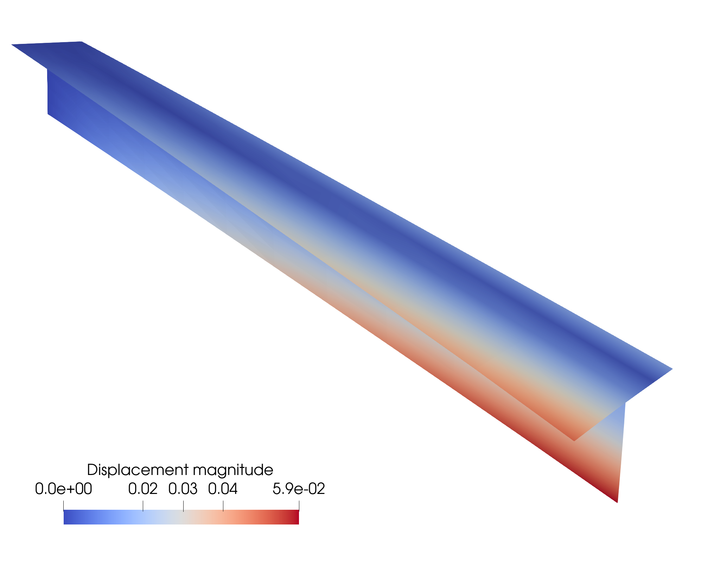

# Torsion of a T-beam
This demo simulates a pinned T-beam at one end is subjected to a vertical point load at one corner on the free end. Problem configuration is depicted in Section 3.2 of [Herrema et al.](https://doi.org/10.1016/j.cma.2018.08.038). The Python file for this demo can be found [here](https://github.com/hanzhao2020/PENGoLINS/blob/main/demos/T-beam/T_beam.py).  The T-beam geometry in this demo, shown below, consists of two mismatched NURBS patches.
<p align="center">
  
</p>

Similarly, import tIGAr and PENGoLINS as the first step.
```python
from tIGAr.NURBS import *
from PENGoLINS.nonmatching_coupling import *
from PENGoLINS.igakit_utils import *
```
Define material parameters, tip load, and penalty coefficient.
```python
E = Constant(1.0e7)
nu = Constant(0.)
h_th = Constant(0.1)
tip_load = -10.
penalty_coefficient = 1.0e3
```
Define geometric parameters of T-beam.
```python
L = 20.  # Length
w = 2.  # Width
h = 2.  # Height
# Corner locations for patch 0
pts0 = [[-w/2., 0., 0.], [w/2., 0., 0.],\
        [-w/2., L, 0.], [w/2., L, 0.]]
# Corner locations for patch 1
pts1 = [[0., 0., 0.], [0.,0.,-h],\
        [0., L, 0.], [0., L, -h]]
num_field = 3
p = 3  # NURBS degree
num_el = 10
num_el0 = num_el
num_el1 = num_el + 1
```
Define a function for igakit NURBS instances creation and generate two mismatched patches of T-beam.
```python
def create_surf(pts, num_el0, num_el1, p):
    knots0 = np.linspace(0,1,num_el0+1)[1:-1]
    knots1 = np.linspace(0,1,num_el1+1)[1:-1]
    L1 = line(pts[0],pts[1])
    L2 = line(pts[2],pts[3])
    srf = ruled(L1,L2)
    deg0, deg1 = srf.degree 
    srf.elevate(0,p-deg0)
    srf.elevate(1,p-deg1)
    srf.refine(0,knots0)
    srf.refine(1,knots1)
    return srf
# Create two NURBS patches of T-beam
srf0 = create_surf(pts0, int(num_el0/2), num_el0, p)
srf1 = create_surf(pts1, int(num_el1/2), num_el1, p)
```
Again, define a function to create tIGAr extracted splines before performing IGA, and convert igakit NURBS patches to tIGAr extracted splines.
```python
def create_spline(srf, num_field, BCs=[0,1]):
    spline_mesh = NURBSControlMesh(srf, useRect=False)
    spline_generator = EqualOrderSpline(worldcomm, num_field, spline_mesh)

    for field in range(num_field):
        scalar_spline = spline_generator.getScalarSpline(field)
        for para_direction in range(2):
            if BCs[para_direction] == 1:
                side = 0  # Only consider fixing the 0 side
                # Pinned boundary condition
                side_dofs = scalar_spline.getSideDofs(para_direction, 
                                                      side, nLayers=1)
                spline_generator.addZeroDofs(field, side_dofs)

    quad_deg = 3*srf.degree[0]
    spline = ExtractedSpline(spline_generator, quad_deg)
    return spline 
# Create tIGAr extracted splines using igakit NURBS instances
# and store them in a list to initialize non-matching problem
spline0 = create_spline(srf0, num_field, BCs=[0,1])
spline1 = create_spline(srf1, num_field, BCs=[0,1])
splines = [spline0, spline1]
```
Now, we are ready to initialize the coupling of the non-matching problem.
```python
problem = NonMatchingCoupling(splines, E, h_th, nu, comm=worldcomm)
```
Then, we continue to create mortar meshes and unknowns on them.
```python
# Only one intersection in this T-beam geometry
mortar_nels = [2*num_el1]
problem.create_mortar_meshes(mortar_nels)
problem.create_mortar_funcs('CG',1)
problem.create_mortar_funcs_derivative('CG',1)
```
Setting ``mapping_list`` and location of intersection in the parametric space. In this demo, the exact intersection locations in the physical space can be easily found, which is the straight line between points (0,0,0) and (0,20,0). For demonstration, we use Newton's method and the exact physical locations of intersection to compute the parametric locations of mortar mesh.
```python
# Create ``mapping_list``, which has only one element [0,1]
mapping_list = [[0, 1],]
# Compute mortar mesh's parametric locations
physical_locations = [np.array([[0.,0.,0.],[0.,20.,0.]]),]
mortar_mesh_locations = [[]]*problem.num_interfaces
for i in range(problem.num_interfaces):
    for j in range(2):
        mortar_mesh_locations[i] += [interface_parametric_location(
                                     splines[mapping_list[i][j]], 
                                     problem.mortar_meshes[i], 
                                     physical_locations[i]),]
# Pass required information to set up mortar meshes
problem.mortar_meshes_setup(mapping_list, mortar_mesh_locations,
                            penalty_coefficient)
```
Next, we construct the point load and set PDE residuals to the non-matching problem.
```python
source_terms = []
residuals = []
f0 = as_vector([Constant(0.), Constant(0.), Constant(0.)])
ps0 = PointSource(spline0.V.sub(2), Point(1.,1.), -tip_load)
ps_list = [ps0,]  # List of point source instances 
ps_ind = [0,]  # List of indices for point sources

for i in range(len(splines)):
    source_terms += [inner(f0, problem.splines[i].rationalize(\
        problem.spline_test_funcs[i]))*problem.splines[i].dx,]
    residuals += [SVK_residual(problem.splines[i], 
                               problem.spline_funcs[i], 
                               problem.spline_test_funcs[i], 
                               E, nu, h_th, source_terms[i])]
# Pass list of point sources and corresponding indices to ``problem``.
problem.set_residuals(residuals, point_sources=ps_list, 
                      point_source_inds=ps_ind)
```
Assemble the linear non-matching system and solve it.
```python
problem.solve_linear_nonmatching_problem()
```
In this demo, PENGoLINS is able to maintain the angle between two patches of the T-beam during deformation. For verification, we measure the angle at the free end of the T-beam on the deformed configuration, which should be close to $90^\circ$.
```python
# Measure angle between two patches at the end
EPS = 1.0e-2
xi1_load = [array([0.5, 1.0]), array([0.5+EPS, 1.0])]
xi1_free = [array([0.5, 1.0]), array([0.5-EPS, 1.0])]
xi2 = [array([0., 1.]), array([0.+EPS, 1.])]
xis = [xi1_load, xi1_free, xi2]

pts1_load, pts1_free = [], []
pts2_vectical = []
pts_end = [pts1_load, pts1_free, pts2_vectical]
splines_test = [spline0, spline0, spline1]
y_homs_test = [problem.spline_funcs[0], problem.spline_funcs[0], 
               problem.spline_funcs[1]]

for i in range(len(xis)):
    for j in range(2):
        pts_end[i] += [deformed_position(splines_test[i], 
                       xis[i][j], y_homs_test[i]),]

vec1_load = pts1_load[1] - pts1_load[0]
vec1_free = pts1_free[1] - pts1_free[0]
vec2 = pts2_vectical[1] - pts2_vectical[0]

theta_load = vec_angle(vec1_load, vec2)
theta_free = vec_angle(vec1_free, vec2)
print("Angle between the end of two "
      "patches (load end) = {:8.6f}.".format(theta_load))
print("Angle between the end of two"
      " patches (free end) = {:8.6f}.".format(theta_free))
```
The computed angles are:
```
Angle between the end of two patches (load end) = 89.992843.
Angle between the end of two patches (free end) = 90.000250.
```
Finally, we can save the results to pvd files and visualize them in ParaView. The displacement magnitude of the T-beam with a scale factor of 10 is shown.
```python
SAVE_PATH = "./"
for i in range(problem.num_splines):
    save_results(problem.splines[i], problem.spline_funcs[i], i, 
        save_path=SAVE_PATH, save_cpfuncs=True, comm=problem.comm)
```
<p align="center">
  
</p>